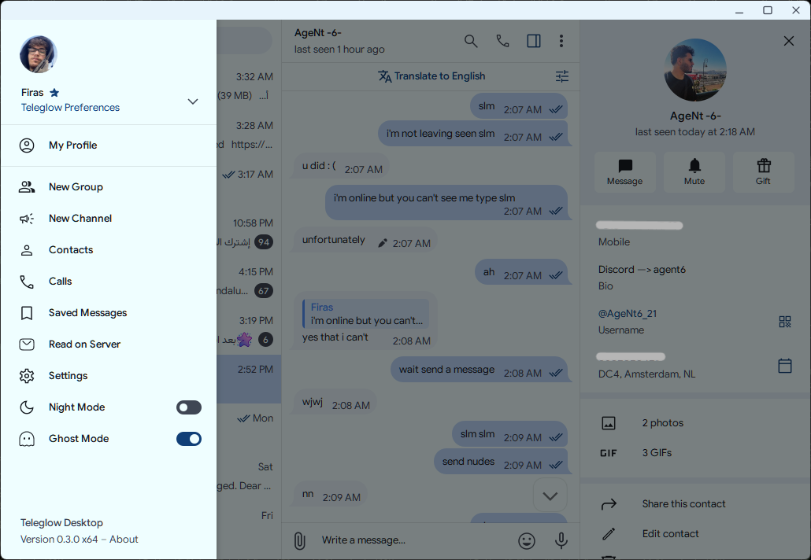
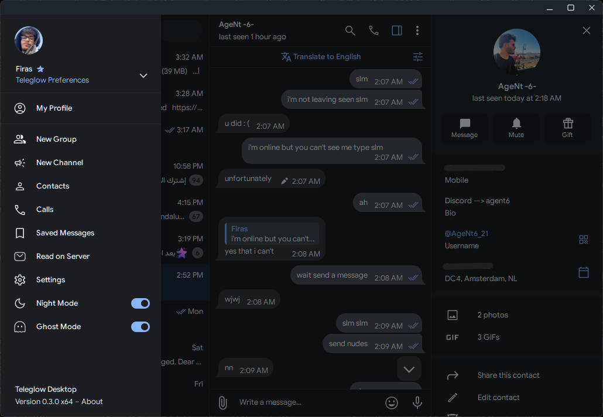

# Teleglow

Teleglow is a fork of [AyuGram Desktop](https://github.com/AyuGram/AyuGramDesktop) with [MaterialGram](https://github.com/kukuruzka165/materialgram) aesthetics applied. It keeps all of AyuGram's privacy and utility features while replacing the default visual style with a cleaner Material Design look.

## Screenshots

## Features
- Ghost mode with flexible read receipts control
- Message history (view deleted and edited messages)
- Anti-recall protection
- Local Telegram Premium features
- Streamer mode
- Font customization
- Built-in message translator
- Google Day and Google Dark themes as the default light and dark themes
- Blue accent color by default across the UI
- Lowercase button labels throughout the interface
- Material Design icon set
- Custom app icon picker in Teleglow Preferences with additional icon options including MaterialGram
- Version numbering independent of upstream Telegram Desktop

## Requirements

- Windows 10 or later (x64)

## Installation

Download the installer from the [Releases](https://github.com/not1cyyy/Teleglow/releases) page and run it. No administrator privileges are required.

## Building from source

See [docs/building-win-x64.md](docs/building-win-x64.md) for Windows build instructions.

## Credits

### Base projects

- [AyuGram Desktop](https://github.com/AyuGram/AyuGramDesktop) by Radolyn Labs
- [MaterialGram](https://github.com/kukuruzka165/materialgram) by kukuruzka165
- [Telegram Desktop](https://github.com/telegramdesktop/tdesktop) by Telegram

### Other Telegram clients referenced

- [Kotatogram](https://github.com/kotatogram/kotatogram-desktop)
- [64Gram](https://github.com/TDesktop-x64/tdesktop)
- [Forkgram](https://github.com/forkgram/tdesktop)

### Libraries

- [JSON for Modern C++](https://github.com/nlohmann/json)
- [SQLite](https://github.com/sqlite/sqlite)
- [sqlite_orm](https://github.com/fnc12/sqlite_orm)

### Icons

- [Solar Icon Set](https://www.figma.com/community/file/1166831539721848736)

### Bots

- [TelegramDB](https://t.me/tgdatabase) for username lookup by ID

## License

This project is licensed under the same terms as Telegram Desktop. See the [LICENSE](LICENSE) file for details.
